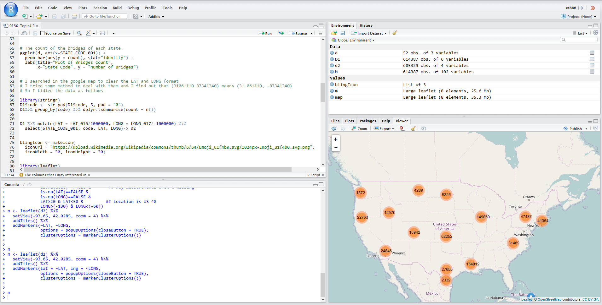

# About the data used in this file

Since the file is too large, I cannot upload it to the Github.

I used the r command `load()` to load the bridge data `M`, which is exactly the one in the workspace of `downloadBridges.R`.

In order to use the data `M`, you can simply save the data from the `downloadBridges.R` with `save(M, file = "./data/tidyBridge.RData")` and then run my code.

# About the Leaflet

It is a cool JavaScript extension displaying interactive map. Some hack guys produced a R packages version of it.

I successfully run my code to produce an interactive map, but since the data is too large, it is so easy to crash that I do not suggest you to run it.

Here is a snip of the code running,

